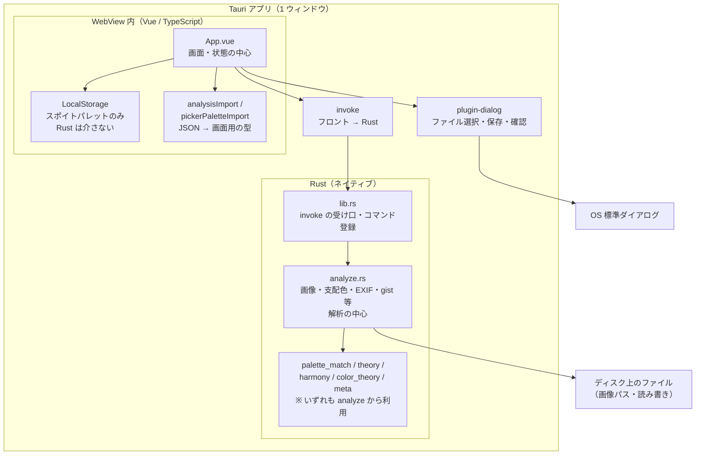
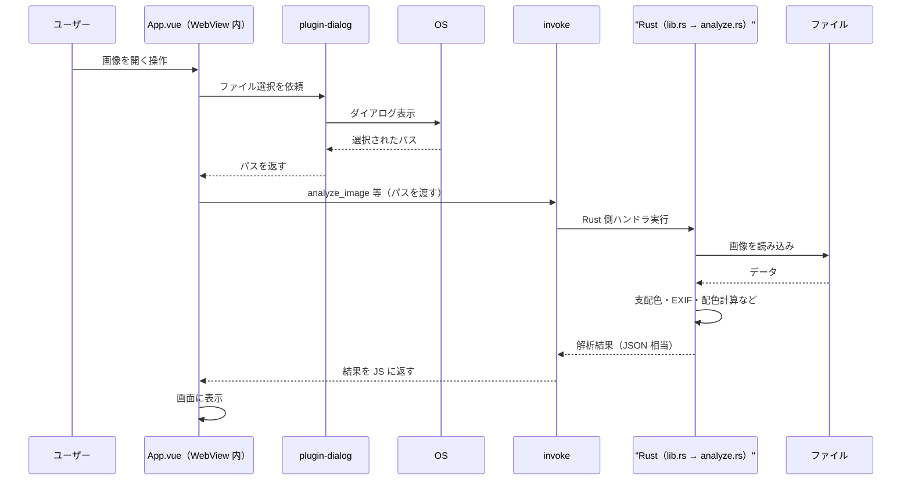

# アーキテクチャ概要

Image Data Analyzer の**処理の流れ**と**主要ディレクトリ**だけをまとめたメモです。細部はコードとコメントを参照してください。

## Tauri 未経験者向け：このアプリの層

1. **WebView** … ウィンドウの中で **Vue（HTML/CSS/JS）が動く領域**です。見た目・ボタン・状態のほとんどはここです。
2. **invoke（インボーク）** … フロントから **Rust の関数を名前で呼び出す**仕組みです（いわゆる RPC に近い）。**画像解析・ピクセル取得・ファイルの読み書き（パスが決まったあと）**など、重い処理やネイティブ向け API はここを通ります。
3. **plugin-dialog** … **OS のファイル選択・保存・確認ダイアログ**を出すための別経路です。`invoke` とは入口が分かれていますが、どちらもフロント（Vue）から呼びます。
4. **Rust** … WebView の外側で動く **ネイティブコード**。`invoke` の先で実際の計算やディスクアクセスが行われます。

**サーバーはありません。** ブラウザにアップロードするのではなく、**自分の PC 上**で完結します。

## 全体像（コンポーネントと依存）

矢印は **「呼び出す／データが流れる」** の向きです。`palette_match` などは **`lib.rs` から直接 invoke されるのではなく**、`analyze.rs` の解析処理の途中で読み込まれます。



## 典型フロー：画像を開いて解析する（時系列）

上のブロック図の補足として、**よくある 1 操作**だけを順番に示します。



## 読み方の補足

| 経路 | 役割 |
|------|------|
| **invoke** | 画像解析（`analyze_image`）、ピクセル取得（`sample_pixel`）、テキスト／バイナリの読み書き（`read_text_file` 等）を Rust に依頼する。 |
| **plugin-dialog** | 画像・JSON・PDF のファイル選択・保存、破壊的操作の確認。見た目は OS ネイティブに近い。 |
| **LocalStorage** | スポイトパレット（`schemaVersion: 1` の複数カラーセット形式）。Rust は介さない。 |
| **analysisImport / pickerPaletteImport** | ファイルから読んだ JSON 文字列を、画面用の型にパース（Vitest で検証）。分析 JSON の `schemaVersion` は Rust 側の **`ANALYSIS_SCHEMA_VERSION`（現在 4）** と一致するのが新規エクスポートの目安（旧番号も読み込み可）。 |

PDF 書き出しは **`PdfExportSurface.vue`**（プレビュー・ファイル情報・主要色・gist・**Open/Tailwind 近似（ΔE2000）**・WCAG・**色彩理論メモ（TheoryBlock）**・調和・EXIF）を **html2canvas + jsPDF** で DOM 画像化し、生成バイト列を `save_binary_file`（invoke 経由）で保存する流れです。**セクション順はメイン画面の解析表示に揃えています**（折りたたみは PDF では常に展開した形）。

## Rust ソースモジュール（`src-tauri/src/`）

`invoke` の先で画像解析に関わる Rust ファイルの対応関係です（細部は各ファイルの先頭コメントを参照）。

| ファイル | 役割 |
|----------|------|
| `lib.rs` | Tauri エントリ、`invoke` コマンドの登録とディスパッチ |
| `analyze.rs` | 画像読込、支配色・EXIF・プレビュー、Open/Tailwind 照合、`TheoryBlock`・調和・gist を含む **解析結果 JSON の組み立て** |
| `meta.rs` | **支配色**（間引き・Lab k-means）、ファイルサイズ・更新日時、EXIF 行の列挙 |
| `color_theory.rs` | sRGB↔Lab、**CIEDE2000**・CIE76、WCAG コントラスト |
| `palette_match.rs` | Open Color / Tailwind JSON の読込と **ΔE2000 最近傍** |
| `theory.rs` | PCCS 風トーン・色相帯・加重平均色相（色彩理論ブロック） |
| `harmony.rs` | **色相調和スコア**（類似・補色・分割補色・トライアド・テトラード） |

## 簡易ディレクトリツリー

ビルド成果物（`dist/`, `target/`）や `node_modules/` は省略しています。

```
image-metadata-tool-tauri/
├── .github/workflows/     # CI（テスト・Windows ビルド）
├── docs/
│   ├── architecture.md      # 本ファイル
│   └── image-analysis.md    # 解析・配色アルゴリズム概要
├── public/                # 静的アセット（Vite）
├── src/
│   ├── App.vue            # メイン UI・パレット・解析パネル
│   ├── main.ts
│   ├── setupAppMenu.ts    # ネイティブメニュー（Tauri 時）
│   ├── components/        # GlossaryModal, PdfExportSurface, PickerPaletteSetBar …
│   ├── constants/         # 用語集テキスト、表示名、凡例など
│   ├── types/             # Analysis 等の共有型
│   └── utils/             # 色フォーマット、パレット保存、JSON インポート、PDF、appLog …
├── src-tauri/
│   ├── src/
│   │   ├── lib.rs         # Tauri エントリ・invoke ハンドラ
│   │   ├── main.rs
│   │   ├── analyze.rs     # 画像読込・サンプリング・支配色・EXIF・プレビュー生成
│   │   ├── palette_match.rs
│   │   ├── theory.rs      # PCCS 風トーン等
│   │   ├── color_theory.rs
│   │   ├── harmony.rs
│   │   └── meta.rs
│   ├── assets/            # Open Color / Tailwind 参照 JSON（Rust が読む）
│   ├── capabilities/
│   ├── icons/
│   ├── Cargo.toml
│   └── tauri.conf.json
├── package.json
├── vite.config.ts
├── vitest.config.ts
├── CHANGELOG.md
└── README.md
```

## 関連ドキュメント

- 利用者向けの機能説明・用語のやさしい説明・開発コマンド: リポジトリ直下の [README.md](../README.md)
- 画像解析・支配色・色差（ΔE2000）・調和スコアなどの**アルゴリズム概要**: [image-analysis.md](./image-analysis.md)
- バージョンごとの変更履歴: リポジトリ直下の [CHANGELOG.md](../CHANGELOG.md)
