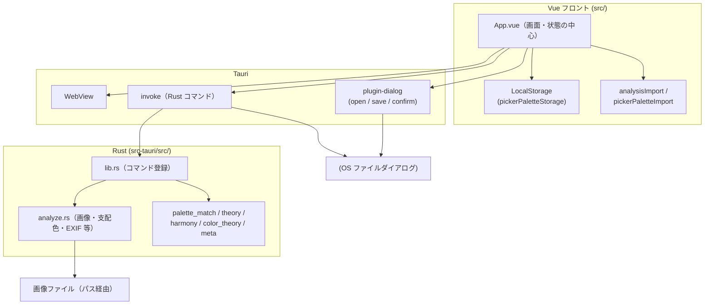

# アーキテクチャ概要

Image Data Analyzer の**処理の流れ**と**主要ディレクトリ**だけをまとめたメモです。細部はコードとコメントを参照してください。

## 全体像（データの流れ）



### 読み方の補足

| 経路 | 役割 |
|------|------|
| **invoke** | 画像解析（`analyze_image`）、ピクセル取得（`sample_pixel`）、テキスト／バイナリの読み書き（`read_text_file` 等）を Rust に依頼する。 |
| **plugin-dialog** | 画像・JSON・PDF のファイル選択・保存、破壊的操作の確認。見た目は OS ネイティブに近い。 |
| **LocalStorage** | スポイトパレット（複数カラーセット v1）。Rust は介さない。 |
| **analysisImport / pickerPaletteImport** | ファイルから読んだ JSON 文字列を、画面用の型にパース（Vitest で検証）。 |

PDF 書き出しは **html2canvas + jsPDF** で DOM を画像化し、生成バイト列を `save_binary_file` で保存する流れです。

## 簡易ディレクトリツリー

ビルド成果物（`dist/`, `target/`）や `node_modules/` は省略しています。

```
image-metadata-tool-tauri/
├── .github/workflows/     # CI（テスト・Windows ビルド）
├── docs/
│   └── architecture.md    # 本ファイル
├── public/                # 静的アセット（Vite）
├── src/
│   ├── App.vue            # メイン UI・パレット・解析パネル
│   ├── main.ts
│   ├── setupAppMenu.ts    # ネイティブメニュー（Tauri 時）
│   ├── components/        # GlossaryModal, PdfExportSurface, PickerPaletteSetBar …
│   ├── constants/         # 用語集テキスト、表示名、凡例など
│   ├── types/             # Analysis 等の共有型
│   └── utils/             # 色フォーマット、パレット保存、JSON インポート、PDF、appLog …
├── src-tauri/
│   ├── src/
│   │   ├── lib.rs         # Tauri エントリ・invoke ハンドラ
│   │   ├── main.rs
│   │   ├── analyze.rs     # 画像読込・サンプリング・支配色・EXIF・プレビュー生成
│   │   ├── palette_match.rs
│   │   ├── theory.rs      # PCCS 風トーン等
│   │   ├── color_theory.rs
│   │   ├── harmony.rs
│   │   └── meta.rs
│   ├── assets/            # Open Color / Tailwind 参照 JSON（Rust が読む）
│   ├── capabilities/
│   ├── icons/
│   ├── Cargo.toml
│   └── tauri.conf.json
├── package.json
├── vite.config.ts
├── vitest.config.ts
├── CHANGELOG.md
└── README.md
```

## 関連ドキュメント

- 利用者向けの機能説明・開発コマンド: リポジトリ直下の [README.md](../README.md)
